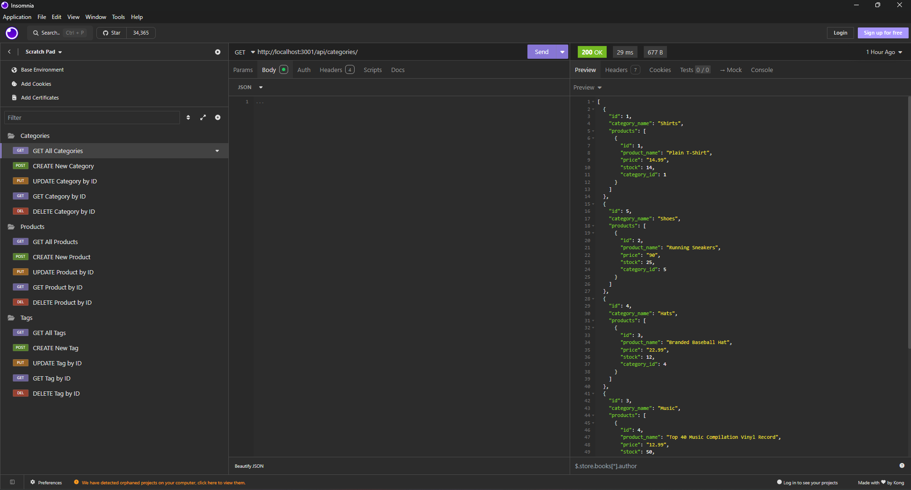
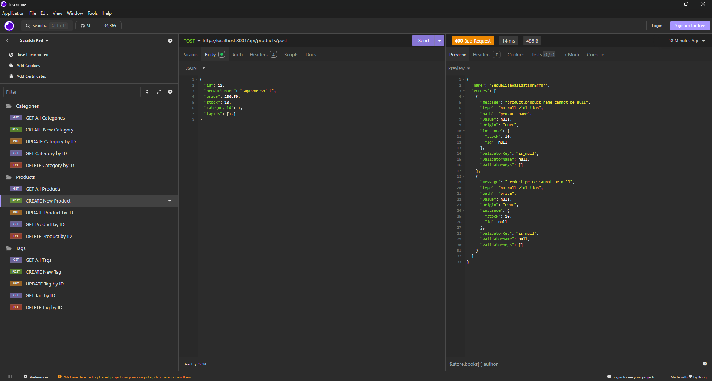

# E-Commerce-Back-End
A back end build for an e-commerce site, site built using an Express.js API with Sequelize to interact with a PostgreSQL database.


<!-- Improved compatibility of back to top link: See: https://github.com/othneildrew/Best-README-Template/pull/73 -->
<a name="readme-top"></a>
<!--
*** Thanks for checking out the Best-README-Template. If you have a suggestion
*** that would make this better, please fork the repo and create a pull request
*** or simply open an issue with the tag "enhancement".
*** Don't forget to give the project a star!
*** Thanks again! Now go create something AMAZING! :D
-->


<!-- PROJECT SHIELDS -->
<!--
*** I'm using markdown "reference style" links for readability.
*** Reference links are enclosed in brackets [ ] instead of parentheses ( ).
*** See the bottom of this document for the declaration of the reference variables
*** for contributors-url, forks-url, etc. This is an optional, concise syntax you may use.
*** https://www.markdownguide.org/basic-syntax/#reference-style-links
-->
[![Contributors][contributors-shield]][contributors-url]
[![Forks][forks-shield]][forks-url]
[![Stargazers][stars-shield]][stars-url]
[![Issues][issues-shield]][issues-url]
[![MIT License][license-shield]][license-url]
[![LinkedIn][linkedin-shield]][linkedin-url]


<!-- PROJECT LOGO -->
<br />
<div align="center">
  <a href="https://github.com/Nalipas/E-Commerce-Back-End">
    
  </a>

<h3 align="center">E-Commerce Back End</h3>

  <p align="center">
    A back end database build for an E-Commerce platform.
    <br />
    <a href="https://github.com/Nalipas/E-Commerce-Back-End"><strong>Explore the docs »</strong></a>
    <br />
    <br />
    <a href="https://github.com/Nalipas/E-Commerce-Back-End">View Demo</a>
    ·
    <a href="https://github.com/Nalipas/E-Commerce-Back-End/issues/new?labels=bug&template=bug-report---.md">Report Bug</a>
    ·
    <a href="https://github.com/Nalipas/E-Commerce-Back-End/issues/new?labels=enhancement&template=feature-request---.md">Request Feature</a>
  </p>
</div>


<!-- TABLE OF CONTENTS -->
<details>
  <summary>Table of Contents</summary>
  <ol>
    <li>
      <a href="#about-the-project">About The Project</a>
      <ul>
        <li><a href="#built-with">Built With</a></li>
      </ul>
    </li>
    <li>
      <a href="#getting-started">Getting Started</a>
      <ul>
        <li><a href="#prerequisites">Prerequisites</a></li>
        <li><a href="#installation">Installation</a></li>
      </ul>
    </li>
    <li><a href="#usage">Usage</a></li>
    <li><a href="#roadmap">Roadmap</a></li>
    <li><a href="#contributing">Contributing</a></li>
    <li><a href="#license">License</a></li>
    <li><a href="#contact">Contact</a></li>
    <li><a href="#acknowledgments">Acknowledgments</a></li>
  </ol>
</details>


<!-- ABOUT THE PROJECT -->
## About The Project


<p align="right">(<a href="#readme-top">back to top</a>)</p>


### Built With

* [![Express][Express.js]][Express-url]
* [![Postgres][PostgreSQL]][Postgres-url]

<p align="right">(<a href="#readme-top">back to top</a>)</p>


<!-- GETTING STARTED -->
## Getting Started

### Prerequisites

To run this application locally, <a href="https://nodejs.org/en/download/package-manager">Node.js</a> and <a href="https://docs.npmjs.com/downloading-and-installing-node-js-and-npm">Node Package Manager (NPM)</a> are required to download and install the dependencies of this project. You will also need <a href="https://www.postgresql.org/download/">PostgreSQL</a> to handle the database. An in depth tutorial on how to install PostgreSQL is <a href="https://coding-boot-camp.github.io/full-stack/postgresql/postgresql-installation-guide#install-postgresql-server">available here</a>.

Install these prerequisites, then run this command in your CLI to install NPM.
* npm
  ```sh
  npm install -g npm
  ```


### Installation

1. Clone the repo
   ```sh
   git clone https://github.com/Nalipas/E-Commerce-Back-End.git
   ```
2. Install NPM packages
   ```sh
   npm install
   ```
3. Login to PostgreSQL
    ```sh
    psql -U 'username'
    ```
4. Run the schema
    ```sql
    \i db/schema.sql
    ```
5. Seed the database
    ```js
    npm run seed
    ```
6. Start the applicaiton
   ```js
   npm run start
   ```

<p align="right">(<a href="#readme-top">back to top</a>)</p>


<!-- USAGE EXAMPLES -->
## Usage

This application provides the back end database for an E-Commerce platform. 

Here you can see this database explored via <a href="https://insomnia.rest/">Insomnia REST API</a>. 




<p align="right">(<a href="#readme-top">back to top</a>)</p>


<!-- ROADMAP -->
## Roadmap

Not Applicable

See the [open issues](https://github.com/Nalipas/E-Commerce-Back-End/issues) for a full list of proposed features (and known issues).

<p align="right">(<a href="#readme-top">back to top</a>)</p>


<!-- CONTRIBUTING -->
## Contributing

Contributions are what make the open source community such an amazing place to learn, inspire, and create. Any contributions you make are **greatly appreciated**.

If you have a suggestion that would make this better, please fork the repo and create a pull request. You can also simply open an issue with the tag "enhancement".
Don't forget to give the project a star! Thanks again!

1. Fork the Project
2. Create your Feature Branch (`git checkout -b feature/AmazingFeature`)
3. Commit your Changes (`git commit -m 'Add some AmazingFeature'`)
4. Push to the Branch (`git push origin feature/AmazingFeature`)
5. Open a Pull Request

<p align="right">(<a href="#readme-top">back to top</a>)</p>


<!-- LICENSE -->
## License

Distributed under the MIT License. See `LICENSE.txt` for more information.

<p align="right">(<a href="#readme-top">back to top</a>)</p>


<!-- CONTACT -->
## Contact

Your Name - [@msteven14](https://twitter.com/msteven14) - smoreno2014@gmail.com

Project Link: [https://github.com/Nalipas/E-Commerce-Back-End](https://github.com/Nalipas/E-Commerce-Back-End)

<p align="right">(<a href="#readme-top">back to top</a>)</p>


<!-- ACKNOWLEDGMENTS -->
## Acknowledgments

* [Mark Carlson](https://github.com/mark-carlson) for instructor support
* [Mariah Wear](https://github.com/mariahw4) for TA support
* [Clarence C]() for TA support

<p align="right">(<a href="#readme-top">back to top</a>)</p>


<!-- MARKDOWN LINKS & IMAGES -->
<!-- https://www.markdownguide.org/basic-syntax/#reference-style-links -->
[contributors-shield]: https://img.shields.io/github/contributors/Nalipas/E-Commerce-Back-End.svg?style=for-the-badge
[contributors-url]: https://github.com/Nalipas/E-Commerce-Back-End/graphs/contributors
[forks-shield]: https://img.shields.io/github/forks/Nalipas/E-Commerce-Back-End.svg?style=for-the-badge
[forks-url]: https://github.com/Nalipas/E-Commerce-Back-End/network/members
[stars-shield]: https://img.shields.io/github/stars/Nalipas/E-Commerce-Back-End.svg?style=for-the-badge
[stars-url]: https://github.com/Nalipas/E-Commerce-Back-End/stargazers
[issues-shield]: https://img.shields.io/github/issues/Nalipas/E-Commerce-Back-End.svg?style=for-the-badge
[issues-url]: https://github.com/Nalipas/E-Commerce-Back-End/issues
[license-shield]: https://img.shields.io/github/license/Nalipas/E-Commerce-Back-End.svg?style=for-the-badge
[license-url]: https://github.com/Nalipas/E-Commerce-Back-End/blob/master/LICENSE.txt
[linkedin-shield]: https://img.shields.io/badge/-LinkedIn-black.svg?style=for-the-badge&logo=linkedin&colorB=555
[linkedin-url]: https://linkedin.com/in/msteven14
[product-screenshot]: images/screenshot.png

[Express.js]: https://img.shields.io/badge/express-000000?style=for-the-badge&logo=express&logoColor=white
[Express-url]: https://expressjs.com
[PostgreSQL]: https://img.shields.io/badge/postgresql-4169e1?style=for-the-badge&logo=postgresql&logoColor=white
[Postgres-url]: https://www.postgresql.org/
